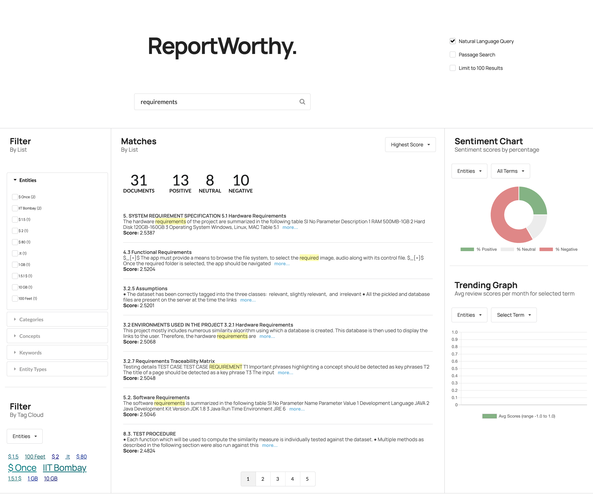

# ReportWorthy
An ongoing research project that will allow professors to collectively analyze student project reports, without actually going through them individually. 

We will be using data in form of PDF reports curated by Prof. Viraj Kumar (IISc Bangalore, India). 

When the reader has completed this code pattern, they will understand how to:

## Flow

1. The Student report pdf files are added to the Discovery collection.
1. The user interacts with the backend server via the app UI. The frontend app UI uses React to render search results and can reuse all of the views that are used by the backend for server side rendering. The frontend is using semantic-ui-react components and is responsive.
1. User input is processed and routed to the backend server, which is responsible for server side rendering of the views to be displayed on the browser. The backend server is written using express and uses express-react-views engine to render views written using React.
1. The backend server sends user requests to the Watson Discovery Service. It acts as a proxy server, forwarding queries from the frontend to the Watson Discovery Service API while keeping sensitive API keys concealed from the user.

# Sample UI layout

Note that each review will be truncated to 200 characters or less. A `more...` button will be provided for each review, and when clicked, the full review title and text will be displayed in a pop-up modal window, as shown below:

If the `more...` button is clicked, the review data will be passed back to Discovery so that it can be logged as a relevant review for the query. Refer to the [Watson Discovery Continuous Relevancy Training](#watson-discovery-continuous-relevancy-training) section above for more information on this feature.

## UI controls and associated actions

1. Search field and search parameters: Return results based on search criteria. Search parameters will effect how the user will enter values, how they will be displayed, and limit the number of matches.
1. List Filters: Multiple drop-down lists of filters that are applied to the search resullts. Each drop down list contains entities, categories, concepts and keywords associated with the results. For each drop down filter item, the number of matches will also be displayed. If a user selects a filter item, a new search will be conducted and will update the results panel (#3). Filter items selected will also effect what is shown in the tag cloud (#4).
1. Search results and pagination menu: Shows a page of result items (e.g. 5 per page) and a pagination menu to allow the user to scroll through pages of result items. There will also be a drop-down menu that will allow the user to sort the entries based on date, score, and sentiment value.
1. Tag cloud filter: Similar to the list filters (#2) but in a different format. One set of filter items (either entities, categories, concepts or keywords) can be displayed at one time. User can select/deselect items in the cloud to turn on/off filters. Applied filters in both filter views (#2 and #4) will always be in sync.
1. Trend chart: Chart to show the sentiment trend for a specific entity, category, concept, or keyword over time. The data will reflect the current matching result set.
1. Sentiment chart: Donut chart that shows the total percentages of postive, neutral and negative reviews of selected entities, categories, concepts, or keywords. The data will reflect the current matching result set.

> Note: see [DEVELOPING.md](DEVELOPING.md) for project structure.

## Included components

* [Watson Discovery](https://www.ibm.com/watson/services/discovery/): A cognitive search and content analytics engine for applications to identify patterns, trends, and actionable insights.

## Featured technologies

* [Node.js](https://nodejs.org/): An open-source JavaScript run-time environment for executing server-side JavaScript code.
* [React](https://reactjs.org/): A JavaScript library for building User Interfaces.
* [Express](https://expressjs.com) - A popular and minimalistic web framework for creating an API and Web server.
* [Semantic UI React](https://react.semantic-ui.com/): React integration of Semantic UI components. 
* [Chart.js](https://www.chartjs.org/): JavaScript charting package.
* [Jest](https://jestjs.io/): A JavaScript test framework.

## Deployment options

Click on one of the options below for instructions on deploying the app.

|   |   |   |
| - | - | - |
|  |  |  |

# Troubleshooting

* Error: Environment {GUID} is still not active, retry once status is active

  > This is common during the first run. The app tries to start before the Discovery
environment is fully created. Allow a minute or two to pass. The environment should
be usable on restart. If you used `Deploy to IBM Cloud` the restart should be automatic.

* Error: Only one free environment is allowed per organization

  > To work with a free trial, a small free Discovery environment is created. If you already have a Discovery environment, this will fail. If you are not using Discovery, check for an old service thay you may want to delete. Otherwise use the .env DISCOVERY_ENVIRONMENT_ID to tell the app which environment you want it to use. A collection will be created in this environment using the default configuration.

* Error when loading files into Discovery

  > Loading all 2000 document files at one time into Discovery can sometimes lead to "busy" errors. If this occurs, start over and load a small number of files at a time.

* No keywords appear in the app

  > This can be due to not having a proper configuration file assigned to your data collection. See [Step 3](#3-load-the-discovery-files) above.

* When using the `Deploy to IBM Cloud` button, you get a failure during the `Deploy Stage`, as shown in this log message:

  

  > This can occur if the discovery service is not yet provisioned (you can check the resourse list in the `IBM Cloud` dashboard to verify). If so, wait until the service is marked as `Provisioned`, and then hit the `Redeploy` button at the top of the `Deply Stage` panel. After successfully deploying and connecting to the discovery service, check the logs of the running deployed app to check its progress as it loads the json files into the discovery collection.

# License

This code pattern is licensed under the Apache Software License, Version 2.  Separate third party code objects invoked within this code pattern are licensed by their respective providers pursuant to their own separate licenses. Contributions are subject to the [Developer Certificate of Origin, Version 1.1 (DCO)](https://developercertificate.org/) and the [Apache Software License, Version 2](https://www.apache.org/licenses/LICENSE-2.0.txt).

[Apache Software License (ASL) FAQ](https://www.apache.org/foundation/license-faq.html#WhatDoesItMEAN)
